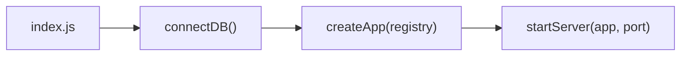
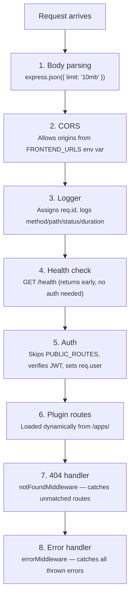

# Backend Architecture

How the CampusOS Express server actually works, traced through the source code.

> **Note**: The backend uses Express **v5** (5.2.1). This means async error handling works natively in route handlers — thrown errors are caught by the error middleware without needing `express-async-errors`.

## Startup Flow

When you run `pnpm dev` in the backend (which runs `node --watch src/index.js`), this is what happens:



1. `index.js` calls `connectDB()` to connect to MongoDB
2. It passes the global `registry` singleton to `createApp()`
3. `createApp()` builds the Express app with middleware and plugins
4. `startServer()` starts listening on port `4000`

If MongoDB is unreachable or any step fails, the process exits with code `1`.

## File Map

```
backend/src/
├── index.js                  # Entry point — calls connectDB → createApp → startServer
├── app.js                    # Creates Express app, loads middleware + plugins
├── server.js                 # HTTP server with graceful shutdown
├── plugin-loader.js          # Scans /apps/ and calls init() on each module
│
├── auth/
│   └── jwt-authenticator.js  # JWT sign/verify, registered as authenticator
│
├── middleware/
│   ├── auth.js               # JWT verification, public route allowlist
│   ├── permissions.js        # requireRoles() — RBAC middleware factory
│   ├── logger.js             # Request logging with trace IDs
│   └── error.js              # Error handler + 404 handler
│
├── database/
│   ├── connection.js         # Mongoose connect/disconnect/healthCheck
│   └── schemas/              # Mongoose models for Phase 5 modules
│
└── utils/
    └── registry.js           # ModuleRegistry class — service locator
```

## Middleware Chain

The order in `app.js` matters. Middleware runs top-to-bottom for every request:



### Public Routes (no auth required)

These are hardcoded in `middleware/auth.js`:

- `GET /health`
- `POST /api/v1/auth/signup`
- `POST /api/v1/auth/login`
- `GET /api/v1/events` (listing)
- `GET /api/v1/events/:id` (single event)
- `POST /api/v1/events/:id/registrations`

Everything else requires a `Bearer` token in the `Authorization` header.

## Service Registry

The registry (`utils/registry.js`) is a singleton `ModuleRegistry` with 4 Map-based stores:

```javascript
registry.modules; // Map — loaded plugin metadata
registry.services; // Map — shared service instances
registry.authenticators; // Map — auth strategies (e.g., 'jwt')
registry.resolvers; // Map — data resolvers
```

It's attached to the Express app via `app.locals.registry`, so any middleware or route handler can access it:

```javascript
// In a plugin's init function — register something
registry.registerService('requireRoles', requireRoles);
registry.registerAuthenticator('jwt', jwtAuthenticator);
registry.registerModule('vendor', { routes: [...] });

// In a controller — retrieve something
const requireRoles = req.app.locals.registry.getService('requireRoles');
```

This is how modules communicate without importing each other.

## Plugin Loader

`plugin-loader.js` scans the `/apps/` directory and loads each module:

1. Connects to MongoDB via `connectDB()`
2. Reads all directories in `/apps/`
3. Queries the `Plugin` MongoDB collection to find which plugins are enabled
4. For each directory, checks if it's marked `enabled: true` in the DB
5. Looks for an entry point in this order:
   - `plugin.js` (root of module)
   - `src/index.js`
6. Dynamically imports the entry file
7. Calls `init(app, registry)` — the module's exported function
8. If a module fails to load, it logs the error but continues loading others

In production, a plugin failure is fatal. In development, it's logged and skipped.

## Authentication Flow

1. `jwt-authenticator.js` creates a `{ sign, verify }` object using `jsonwebtoken`
2. It's registered in the registry as `authenticator('jwt')`
3. `middleware/auth.js` retrieves it from the registry for every non-public request
4. On success, `req.user` is set to `{ id, email, role }`
5. JWT secret comes from `JWT_SECRET` env var (required in production, has dev fallback)
6. Default token expiry: `15m` (override with `JWT_EXPIRES_IN` env var)

## RBAC

`middleware/permissions.js` exports `requireRoles()` — a factory that returns middleware:

```javascript
// In a route definition:
router.delete('/:id', requireRoles('admin'), controller.delete);
router.post('/', requireRoles('admin', 'coordinator'), controller.create);
```

Valid roles: `admin`, `coordinator`, `volunteer`

The `requireRoles` function is registered as a service so plugins can access it:

```javascript
const requireRoles = registry.getService('requireRoles');
```

## Error Handling

`middleware/error.js` provides two handlers:

- **`notFoundMiddleware`** — Returns 404 with the attempted route path
- **`errorMiddleware`** — Catches all errors:
  - Validation errors (with `err.details`) → 400 with field-level details
  - All other errors → status from `err.status` or 500
  - In development mode, includes stack trace in response
  - Includes `requestId` from the logger for tracing

## Database Connection

`database/connection.js` manages Mongoose with these settings:

| Setting                    | Value   |
| -------------------------- | ------- |
| `serverSelectionTimeoutMS` | 5000ms  |
| `socketTimeoutMS`          | 45000ms |
| `maxPoolSize`              | 10      |
| `minPoolSize`              | 2       |

Default URI: `mongodb://localhost:27017/campusos`

Exports: `connectDB()`, `disconnectDB()`, `healthCheck()`, `isDBConnected()`

## Testing Strategy

Testing in the CampusOS backend is executed using **Vitest** paired with **MongoDB Memory Server**.

1. **In-Memory Database**: Tests instantiate a fresh MongoDB Memory Server instance. This eliminates the need for Docker or external databases for testing, and ensures accurate execution of Mongoose models, validation hooks, and compound indexes.
2. **Isolation**: Tests are isolated per-plugin. Each test suite typically handles its own `connectDB` and `disconnectDB` lifecycle using the memory server URI.
3. **Mongoose Best Practices**: The tests enforce modern Mongoose standards, heavily relying on `{ returnDocument: 'after' }` in `findOneAndUpdate` calls rather than the deprecated `{ new: true }` option.
4. **Execution**: To run tests across all backend plugins, run `pnpm test` from the workspace root or `pnpm -C plugins/<name> test` to test a specific plugin.

---

**See Also**: [Plugin System](./PLUGIN_SYSTEM.md) · [Architecture Overview](./OVERVIEW.md) · [Database Setup](../getting-started/DATABASE_SETUP.md)
