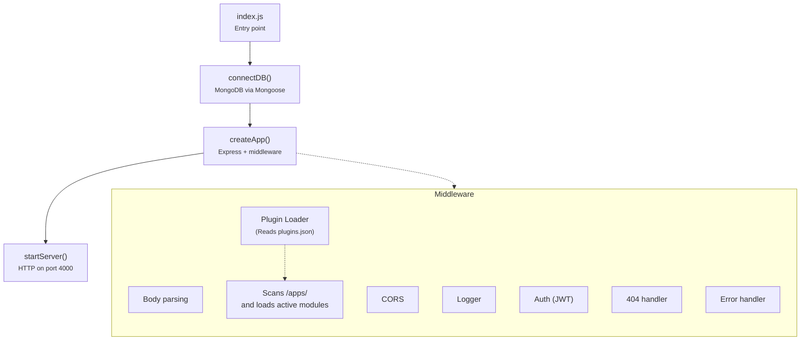
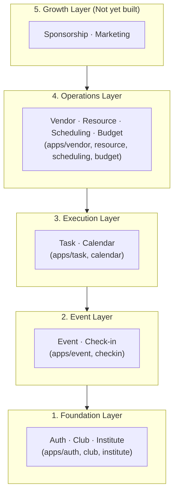

# Architecture Overview

CampusOS is organized around two key ideas: **everything is a plugin module**, and **modules never depend on each other directly**.

## How It Works

## System Layers

Modules are grouped into layers. Lower layers don't depend on higher ones.

### What's in each layer

| Layer          | Modules                                      | What it handles                                                                | Storage   |
| -------------- | -------------------------------------------- | ------------------------------------------------------------------------------ | --------- |
| **Foundation** | `auth`, `club`, `institute`                  | User accounts, JWT auth, RBAC, org structure                                   | Mixed\*   |
| **Event**      | `event`, `checkin`                           | Event CRUD, RSVP/registration, QR check-in                                     | In-memory |
| **Execution**  | `task`, `calendar`                           | Task assignment, dependencies, deadlines                                       | In-memory |
| **Operations** | `vendor`, `resource`, `scheduling`, `budget` | Vendor procurement, resource allocation, time slot scheduling, budget tracking | MongoDB   |
| **Growth**     | _(not yet built)_                            | Sponsorship, marketing, analytics                                              | —         |

\* `auth` uses MongoDB (User schema), `club` and `institute` use in-memory storage.

> **Important**: MongoDB is required to run the server — `connectDB()` runs at startup and the process exits if it fails. However, some modules (Event, Task, Calendar, Club, Institute) store their data in-memory using `Map` objects instead of MongoDB collections. This means data in those modules is lost on server restart. Operations layer modules (Vendor, Resource, Scheduling, Budget) use MongoDB with Mongoose.

## Core Principles

### 1. Every feature is a plugin

All feature code lives in `/apps/<module>/`. The backend core (`backend/src/`) only handles:

- Server lifecycle
- Middleware pipeline
- Plugin loading
- The service registry

### 2. No module-to-module imports

Modules talk to each other through:

- **The service registry** — `registry.getService('requireRoles')`
- **The database** — Modules can read any collection via Mongoose

This rule ensures you can add, remove, or disable modules without breaking others.

### 3. Build vertically, not horizontally

When adding a feature, build it top-to-bottom:

1. Mongoose schema → 2. Service → 3. Controller → 4. Routes → 5. Frontend page

Don't build "all services first, then all controllers." This catches integration issues early.

## Tech Stack

| Component       | Technology                          | Why                                                        |
| --------------- | ----------------------------------- | ---------------------------------------------------------- |
| **Backend**     | Node.js 18+ with Express **v5**     | ES module support, async middleware natively               |
| **Frontend**    | Next.js 16 (App Router) + React 19  | SSR, file-based routing, TypeScript                        |
| **Database**    | MongoDB + Mongoose                  | Flexible schemas, fast prototyping, embedded documents     |
| **UI**          | Tailwind CSS v4 + shadcn/ui         | Utility-first styling with pre-built accessible components |
| **Validation**  | Zod (frontend) + Mongoose (backend) | Schema validation at both ends                             |
| **Auth**        | JWT (HS256)                         | Stateless auth, simple to implement                        |
| **Package mgr** | pnpm (workspaces)                   | Fast, strict, supports monorepo                            |

## Non-Negotiable Rules

1. **Feature code goes in `/apps/`** — Not in `backend/src/`
2. **No direct module imports** — Use the registry or database
3. **Controllers are thin** — Business logic belongs in services
4. **Every module exports `init(app, registry)`** — That's the plugin contract
5. **ES modules only** — `import`/`export`, never `require()`

## When You're Unsure

Ask these questions:

1. Can this be built as a self-contained module in `/apps/`? → If yes, do that.
2. Does this need to import another module directly? → If yes, use the registry instead.
3. Is this business logic in a controller? → Move it to a service.
4. Is this a cross-cutting concern (logging, auth, error handling)? → Put it in `backend/src/middleware/`.

---

**See Also**: [Backend Architecture](./BACKEND.md) · [Plugin System](./PLUGIN_SYSTEM.md) · [Architecture Decisions](./decisions/)
