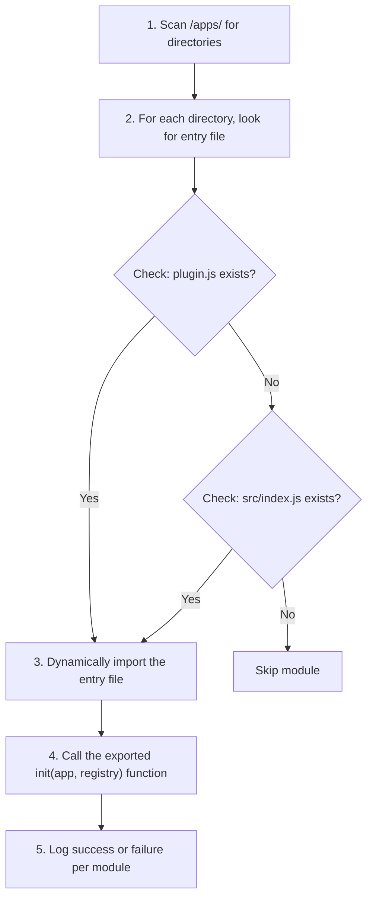

# Plugin System

Every feature in CampusOS is a plugin module in `/apps/`. Modules are loaded dynamically at startup — the backend core never hardcodes which modules exist.

## How Plugin Loading Works

At startup, `plugin-loader.js` does this:



> **Note (ADR-006):** Before loading a plugin, the loader checks the `Plugin` collection in MongoDB. If a plugin is marked as `enabled: false`, it is skipped. New, undiscovered plugins dropped into `/apps/` are automatically inserted into MongoDB and disabled by default for security.

If a module fails to load:

- **Development**: Error is logged, other modules continue loading
- **Production**: The entire server crashes (fail-fast)

## Plugin Management (ADR 006)

Plugins are managed via the built-in `plugin-manager` module. This provides a `super-admin` API to list plugins, toggle them in MongoDB, and trigger a safe restart of the server (`SIGTERM`) to apply the new configuration dynamically without breaking the Express router stack.

## Frontend Plugin Architecture (ADR 007)

When a plugin introduces UI components, CampusOS uses **Build-Time Integration**. The frontend components are injected into the frontend directory, and the system runs `pnpm build`. This avoids complex micro-frontend configurations while maintaining perfect type safety and native performance.


## Real Plugin Entry Points

Here's what actual modules look like in the codebase:

### Auth module (`apps/auth/src/index.js`)

```javascript
import { createAuthController } from './controller/auth.controller.js';
import { registerAuthRoutes } from './routes/auth.routes.js';

export async function init(app, registry) {
  const authController = createAuthController({ registry });
  registerAuthRoutes(app, authController);

  registry.registerModule('auth', {
    routes: ['/api/v1/auth/signup', '/api/v1/auth/login', '/api/v1/auth/me']
  });
}
```

### Vendor module (`apps/vendor/src/index.js`)

```javascript
import { registerVendorRoutes } from './routes/vendor.routes.js';

export async function init(app, registry) {
  const requireRoles = registry.getService('requireRoles');

  if (typeof requireRoles !== 'function') {
    throw new Error('Permission middleware service is not configured');
  }

  registerVendorRoutes(app, requireRoles);

  registry.registerModule('vendor', {
    routes: [
      'POST /api/v1/vendors',
      'GET /api/v1/vendors'
      // ... etc
    ]
  });
}
```

### Key patterns to notice:

1. **Export a named `init` function** (or default export) — the loader accepts either
2. **Receive `(app, registry)` as arguments** — `app` is Express, `registry` is the service locator
3. **Get shared services from the registry** — like `requireRoles` for RBAC
4. **Register your routes directly on `app`** — there's no route aggregator
5. **Register your module in the registry** — `registry.registerModule('name', { routes })` for discoverability

## Module Directory Structure

Every module follows this layout:

```
apps/<module>/
├── package.json              # Module dependencies
├── vitest.config.js          # Test configuration (if tests exist)
└── src/
    ├── index.js              # Plugin entry — exports init()
    ├── controller/
    │   └── <name>.controller.js
    ├── routes/
    │   └── <name>.routes.js
    ├── schema/
    │   └── <name>.schema.js  # Mongoose model
    └── service/
        ├── <name>.service.js
        └── <name>.service.test.js
```

## Current Modules

These are the actual directories in `/apps/` right now:

| Module     | Directory          | Layer      |
| ---------- | ------------------ | ---------- |
| Auth       | `apps/auth/`       | Foundation |
| Club       | `apps/club/`       | Foundation |
| Institute  | `apps/institute/`  | Foundation |
| Event      | `apps/event/`      | Event      |
| Check-in   | `apps/checkin/`    | Event      |
| Task       | `apps/task/`       | Execution  |
| Calendar   | `apps/calendar/`   | Execution  |
| Vendor     | `apps/vendor/`     | Operations |
| Resource   | `apps/resource/`   | Operations |
| Scheduling | `apps/scheduling/` | Operations |
| Budget     | `apps/budget/`     | Operations |

## Module Communication Rules

Modules cannot import each other. This is enforced by convention:

```javascript
// ❌ NEVER — this creates a hard dependency
import { UserService } from '../../auth/src/service/auth.service.js';

// ✅ Use the registry — loose coupling
const requireRoles = registry.getService('requireRoles');
```

Modules communicate through:

1. **The service registry** — `registry.getService('name')` / `registry.registerService('name', impl)`
2. **The database** — Modules can read any MongoDB collection, but each module owns its own collections

## Creating a New Module

### Step 1: Scaffold the directory

```bash
mkdir -p apps/my-module/src/{controller,routes,schema,service}
```

### Step 2: Create the Mongoose schema

```javascript
// apps/my-module/src/schema/my-module.schema.js
import mongoose from 'mongoose';

const myModuleSchema = new mongoose.Schema(
  {
    name: { type: String, required: true },
    status: { type: String, enum: ['active', 'inactive'], default: 'active' }
  },
  { timestamps: true }
);

export const MyModel = mongoose.model('MyModel', myModuleSchema);
```

### Step 3: Create the service (business logic)

```javascript
// apps/my-module/src/service/my-module.service.js
import { MyModel } from '../schema/my-module.schema.js';

export class MyModuleService {
  async create(data) {
    const doc = new MyModel(data);
    await doc.save();
    return { success: true, data: doc.toObject() };
  }

  async getAll(filters = {}) {
    const docs = await MyModel.find(filters);
    return { success: true, count: docs.length, data: docs };
  }
}
```

### Step 4: Create the controller (thin HTTP layer)

```javascript
// apps/my-module/src/controller/my-module.controller.js
import { MyModuleService } from '../service/my-module.service.js';

const service = new MyModuleService();

export async function create(req, res, next) {
  try {
    const result = await service.create(req.body);
    res.status(201).json(result);
  } catch (error) {
    next(error);
  }
}

export async function getAll(req, res, next) {
  try {
    const result = await service.getAll(req.query);
    res.json(result);
  } catch (error) {
    next(error);
  }
}
```

### Step 5: Create the routes

```javascript
// apps/my-module/src/routes/my-module.routes.js
import { Router } from 'express';
import * as controller from '../controller/my-module.controller.js';

export function registerMyModuleRoutes(app, requireRoles) {
  const router = Router();

  router.get('/', controller.getAll);
  router.post('/', requireRoles('admin', 'coordinator'), controller.create);

  app.use('/api/v1/my-module', router);
}
```

### Step 6: Create the plugin entry

```javascript
// apps/my-module/src/index.js
import { registerMyModuleRoutes } from './routes/my-module.routes.js';

export async function init(app, registry) {
  const requireRoles = registry.getService('requireRoles');
  registerMyModuleRoutes(app, requireRoles);

  registry.registerModule('my-module', {
    routes: ['GET /api/v1/my-module', 'POST /api/v1/my-module']
  });
}
```

The module will be automatically discovered and loaded on the next server start.

---

**See Also**: [Backend Architecture](./BACKEND.md) · [Architecture Overview](./OVERVIEW.md) · [API Standards](../guides/API_STANDARDS.md)
