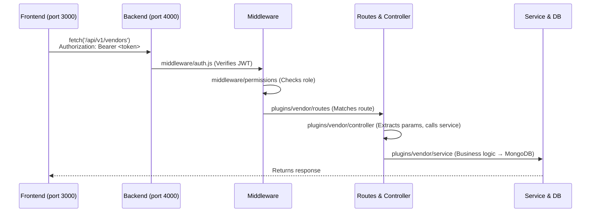

# Developer Onboarding

Everything you need to go from zero to your first merged PR.

## 1. Set Up Your Environment

Follow the [Quick Start](./QUICK_START.md) to clone the repo, install dependencies, start MongoDB, and run the backend + frontend.

Once you see this in your terminal, you're ready:

```
🚀 CampusOS Backend running on http://localhost:4000
📝 Environment: development
✅ MongoDB connected successfully
```

## 2. Understand the Project Structure

```
CampusOS/
├── plugins/                   # Feature modules (plugins)
│   ├── auth/              #   User registration, login, JWT
│   ├── club/              #   Club management
│   ├── institute/         #   Institute management
│   ├── event/             #   Event CRUD
│   ├── checkin/           #   QR check-in
│   ├── task/              #   Task assignment
│   ├── calendar/          #   Calendar management
│   ├── vendor/            #   Vendor management
│   ├── resource/          #   Resource allocation
│   ├── scheduling/        #   Time slot scheduling
│   └── budget/            #   Budget tracking
│
├── backend/src/            # Express server core
│   ├── index.js           #   Entry point
│   ├── app.js             #   Middleware + plugin loading
│   ├── server.js          #   HTTP server
│   ├── plugin-loader.js   #   Scans /plugins/ at startup
│   ├── auth/              #   JWT authenticator
│   ├── middleware/         #   auth, error, logger, permissions
│   ├── database/          #   MongoDB connection + schemas
│   └── utils/registry.js  #   Service registry (module communication)
│
├── frontend/               # Next.js 16 application
│   ├── app/               #   Pages (App Router)
│   ├── components/        #   ThemeToggle + shadcn/ui components
│   └── lib/               #   API clients, auth session, theme provider
│
├── docs/                   # Documentation (you are here)
└── .github/                # CI/CD, issue templates, agent configs
```

See [Project Structure](../project/PROJECT_STRUCTURE.md) for the full breakdown.

## 3. Make Your First Contribution

### Find an issue

Look for [`good-first-issue`](https://github.com/NITRR-Official/CampusOS/issues?q=label%3Agood-first-issue) on GitHub.
Check our **[Issue Labels Guide](../contributing/LABELS.md)** to understand difficulty levels and find tasks matching your skills!

### Create a branch

```bash
git checkout -b feature/<issue-number>-<short-description>
# Example: git checkout -b feature/42-add-vendor-search
```

### Make changes

- **Backend feature?** → Add/modify a module in `plugins/<module>/`
- **Frontend page?** → Add pages in `frontend/app/`
- **Both?** → Build vertically: schema → service → controller → routes → frontend

### Run quality checks

```bash
pnpm format         # Auto-fix formatting (required — CI rejects unformatted code)
pnpm lint           # ESLint
pnpm build          # Build check
```

> [!WARNING]
> **`pnpm format` is mandatory.** CI runs `pnpm format:check` which will **fail** if your code isn't formatted with Prettier. Always run `pnpm format` before pushing.

### Commit and push

```bash
git add .
git commit -m "feat(vendor): add vendor search by category"
git push origin feature/42-add-vendor-search
```

Then create a Pull Request on GitHub targeting the **`dev`** branch.

## 4. Key Commands

```bash
# Development
cd backend && pnpm dev       # Backend (port 4000)
cd frontend && pnpm dev      # Frontend (port 3000)

# Quality
pnpm format                  # Auto-format (run before every push)
pnpm lint                    # Lint all packages
pnpm build                   # Build all packages

# Testing
pnpm -C plugins/vendor test     # Run vendor module tests
pnpm -C plugins/budget test     # Run budget module tests

# MongoDB
docker start mongodb         # Restart MongoDB
docker logs mongodb          # Check MongoDB logs
```

## 5. How Things Connect



## 6. Common Issues

| Problem                            | Solution                                                            |
| ---------------------------------- | ------------------------------------------------------------------- |
| `ECONNREFUSED` on backend start    | MongoDB isn't running → `docker start mongodb`                      |
| Port 3000/4000 already in use      | Kill the process or change `PORT` in `.env`                         |
| `pnpm: command not found`          | `npm install -g pnpm`                                               |
| Backend starts but no plugins load | Check `plugins/` directory exists and modules have `src/index.js`   |
| New plugin skipped / disabled      | Toggle it to enabled using the Plugin Manager API (updates MongoDB) |
| Frontend builds but API calls fail | Backend must be running, check `NEXT_PUBLIC_API_URL`                |
| MongoDB download timeout in tests  | Increase `beforeAll` timeout to `120000`                            |

## 7. Where to Go Next

- [Architecture Overview](../architecture/OVERVIEW.md) — How the system is designed
- [Plugin System](../architecture/PLUGIN_SYSTEM.md) — How to create a new module
- [API Standards](../guides/API_STANDARDS.md) — REST conventions used here
- [Git Workflow](../guides/GIT_WORKFLOW.md) — Branching and PR process
- [Issue Labels Guide](../contributing/LABELS.md) — How to find your next task
- [Testing Guide](../guides/TESTING.md) — How to write tests

---

**See Also**: [Quick Start](./QUICK_START.md) · [Project Structure](../project/PROJECT_STRUCTURE.md) · [Contributing](../contributing/CONTRIBUTING.md)
