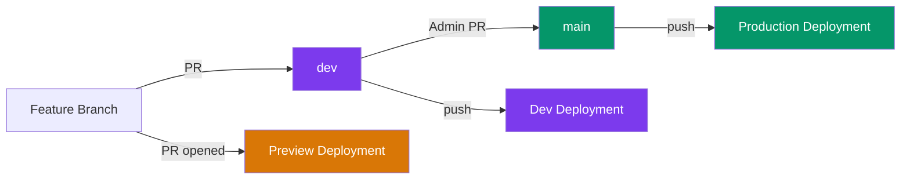
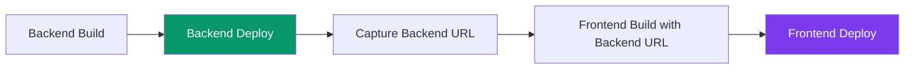

# CI/CD Pipeline

Continuous Integration and Continuous Deployment for CampusOS.

## Branching Strategy

CampusOS uses a two-branch deployment model:

| Branch | Purpose                             | Who Can Merge | Deploys To          |
| ------ | ----------------------------------- | ------------- | ------------------- |
| `main` | Stable, production-ready code       | Admins only   | **Production**      |
| `dev`  | Active development, latest features | Maintainers   | **Dev environment** |



> [!IMPORTANT]
> **Contributors** always open PRs to `dev`. Only **admins** create PRs from `dev` → `main`.

---

## CI — Quality Checks

CI runs automatically on every **pull request** and **push** to `main` or `dev`.

All 5 checks run **in parallel** for fast feedback:

| Check            | Command             | What It Validates                 |
| ---------------- | ------------------- | --------------------------------- |
| **Lint**         | `pnpm lint`         | ESLint across all workspaces      |
| **Type Check**   | `pnpm type-check`   | TypeScript strictness (frontend)  |
| **Format Check** | `pnpm format:check` | Prettier compliance               |
| **Test**         | `pnpm test`         | Test suites across all workspaces |
| **Build**        | `pnpm build`        | Frontend compiles without errors  |

**Workflow file**: [`.github/workflows/ci.yml`](../../.github/workflows/ci.yml)

---

## CD — Deployments

Both the **frontend** (Next.js) and **backend** (Express) are deployed to [Vercel](https://vercel.com).

### Deployment Order

All workflows deploy **backend first, then frontend**. This is because the frontend needs the backend's URL at build time (`NEXT_PUBLIC_API_URL`).



For **preview/dev** deployments, the backend URL is captured from the deploy output and injected into the frontend build automatically. For **production**, the URL is set as a stable env var in the Vercel dashboard.

### How Deployments Are Triggered

| Trigger              | Workflow                | Vercel Environment | Result                                 |
| -------------------- | ----------------------- | ------------------ | -------------------------------------- |
| PR opened/updated    | `vercel-preview.yml`    | Preview            | Unique URL per PR, commented on the PR |
| Push/merge to `dev`  | `vercel-dev.yml`        | Preview            | Dev environment URL (latest on `dev`)  |
| Push/merge to `main` | `vercel-production.yml` | Production         | Production domain                      |

### Preview Deployments (PRs)

When a PR is opened to `dev` or `main`:

1. Backend deploys first → gets a unique preview URL
2. Frontend builds with `NEXT_PUBLIC_API_URL` set to the backend preview URL
3. Frontend deploys → gets its own unique preview URL
4. A bot comments both URLs directly on the PR
5. The comment updates automatically on subsequent pushes

**Workflow file**: [`.github/workflows/vercel-preview.yml`](../../.github/workflows/vercel-preview.yml)

### Dev Deployments

When code is merged into `dev`:

1. Backend deploys first → captures its preview URL
2. Frontend builds with the backend URL injected
3. Both reflect the latest state of active development

**Workflow file**: [`.github/workflows/vercel-dev.yml`](../../.github/workflows/vercel-dev.yml)

### Production Deployments

When code is merged into `main`:

1. Backend deploys first to production
2. Frontend deploys to production (uses stable `NEXT_PUBLIC_API_URL` from Vercel env vars)
3. Both production domains are updated

**Workflow file**: [`.github/workflows/vercel-production.yml`](../../.github/workflows/vercel-production.yml)

---

## Contributor Workflow

```
1. Fork the repo on GitHub
2. Clone your fork locally
3. Create a feature branch from `dev`
4. Make your changes, commit
5. Run `pnpm format` to format your code
6. Push to your fork
7. Open a PR targeting the `dev` branch
   → CI checks run automatically
   → Preview deployment is created (both frontend & backend)
   → Preview URLs are commented on your PR
8. Address review feedback
9. Maintainer merges your PR into `dev`
   → Dev deployment is triggered
```

> [!WARNING]
> **Always run `pnpm format` before pushing.** CI runs `pnpm format:check` and will **reject** your PR if code isn't Prettier-formatted.

> [!NOTE]
> You never need to interact with the `main` branch. That's handled by admins when they're ready to release to production.

---

## Admin Setup Guide

> [!IMPORTANT]
> These steps must be completed **once** before the CI/CD workflows will work.

### Step 1: Link Vercel Projects

```bash
# Install Vercel CLI
npm i -g vercel

# Login
vercel login

# Link frontend
cd frontend
vercel link

# Link backend
cd ../backend
vercel link
```

This creates `.vercel/project.json` in both directories with `orgId` and `projectId`.

### Step 2: Get a Vercel Token

1. Go to [vercel.com/account/tokens](https://vercel.com/account/tokens)
2. Create a token named `CampusOS GitHub Actions`
3. Copy the token

### Step 3: Add GitHub Repository Secrets

Go to **Settings → Secrets and variables → Actions → New repository secret**:

| Secret Name                  | Value                   | Source                          |
| ---------------------------- | ----------------------- | ------------------------------- |
| `VERCEL_TOKEN`               | Your Vercel API token   | Step 2                          |
| `VERCEL_ORG_ID`              | Your Vercel org/user ID | `frontend/.vercel/project.json` |
| `VERCEL_PROJECT_ID_FRONTEND` | Frontend project ID     | `frontend/.vercel/project.json` |
| `VERCEL_PROJECT_ID_BACKEND`  | Backend project ID      | `backend/.vercel/project.json`  |

### Step 4: Add Environment Variables in Vercel

Go to each project on [vercel.com](https://vercel.com) → **Settings → Environment Variables**.

> [!IMPORTANT]
> Use **separate MongoDB databases** for Production and Preview to keep data isolated.

#### Frontend — Environment Variables

| Variable              | Environment    | Value                                  | Notes                                                   |
| --------------------- | -------------- | -------------------------------------- | ------------------------------------------------------- |
| `NEXT_PUBLIC_API_URL` | **Production** | `https://campus-os-backend.vercel.app` | Stable backend production URL                           |
| `NEXT_PUBLIC_API_URL` | **Preview**    | _(optional)_                           | Auto-injected by workflow from backend deploy output    |

> [!TIP]
> For preview/dev deployments, the workflow automatically sets `NEXT_PUBLIC_API_URL` at build time using the backend's actual preview URL. You don't need to configure this in the Vercel dashboard for Preview.

#### Backend — Environment Variables

| Variable             | Environment    | Value                                      | Notes                                          |
| -------------------- | -------------- | ------------------------------------------ | ---------------------------------------------- |
| `NODE_ENV`           | **Production** | `production`                               | Strict error handling, no fallback secrets      |
| `NODE_ENV`           | **Preview**    | `development`                              | Verbose errors, dev fallbacks                   |
| `MONGODB_URI`        | **Production** | `mongodb+srv://...campusos-prod`           | Production database (isolated)                  |
| `MONGODB_URI`        | **Preview**    | `mongodb+srv://...campusos-dev`            | Dev database (separate from production)         |
| `JWT_SECRET`         | **Production** | `<strong-random-secret>`                   | Unique to production                            |
| `JWT_SECRET`         | **Preview**    | `<different-dev-secret>`                   | Unique to preview, different from production    |
| `FRONTEND_URL`       | **Production** | `https://campus-os-frontend.vercel.app`    | CORS: exact match for production frontend       |
| `FRONTEND_URL`       | **Preview**    | `https://campus-os-frontend-git-dev-<user>.vercel.app` | CORS: dev branch frontend URL          |
| `ALLOW_PREVIEW_CORS` | **Preview**    | `true`                                     | Allows any `*.vercel.app` origin for PR previews |
| `JWT_EXPIRES_IN`     | **Both**       | `15m`                                      | Optional, defaults to `15m`                     |

> [!WARNING]
> **Never use the same `MONGODB_URI` for Production and Preview.** Preview deployments could accidentally modify production data. Create two separate databases on [MongoDB Atlas](https://cloud.mongodb.com) (e.g., `campusos-prod` and `campusos-dev`).

### Step 5: Configure Monorepo Root Directories

The backend depends on `apps/` and `shared/` — Vercel needs to know this is a pnpm monorepo.

1. Frontend project → **Settings → General → Root Directory** → `frontend`
2. Backend project → **Settings → General → Root Directory** → `backend`

> [!TIP]
> Vercel will detect `pnpm-workspace.yaml` in the parent folder and run `pnpm install` at the monorepo root, resolving workspace dependencies.

### Step 6: Enable Branch Protection

In GitHub → **Settings → Branches → Add rule**:

**For `main`:**

- ✅ Require status checks to pass (select: `Lint`, `Type Check`, `Format Check`, `Test`, `Build`)
- ✅ Require pull request reviews before merging
- ✅ Restrict who can push (admins only)

**For `dev`:**

- ✅ Require status checks to pass (same checks)

---

## CORS for Preview Deployments

PR preview URLs are unique per commit (e.g., `frontend-abc123.vercel.app`), so the backend can't know them in advance.

The solution: when `ALLOW_PREVIEW_CORS=true` is set (Preview env only), the backend allows **any** `*.vercel.app` origin. This is safe because:

- Preview environments use a **separate database** (`campusos-dev`)
- The flag is **never set in Production** — production uses strict exact-match CORS
- Only applies to `https://*.vercel.app` domains (not arbitrary origins)

---

## Workflow Files Reference

| File                                                                     | Trigger                    | Purpose                         |
| ------------------------------------------------------------------------ | -------------------------- | ------------------------------- |
| [`ci.yml`](../../.github/workflows/ci.yml)                               | PR or push to `main`/`dev` | 5 parallel quality checks       |
| [`vercel-preview.yml`](../../.github/workflows/vercel-preview.yml)       | PR to `main`/`dev`         | Preview deployment + PR comment |
| [`vercel-dev.yml`](../../.github/workflows/vercel-dev.yml)               | Push to `dev`              | Dev environment deployment      |
| [`vercel-production.yml`](../../.github/workflows/vercel-production.yml) | Push to `main`             | Production deployment           |

---

**See Also**: [Git Workflow](./GIT_WORKFLOW.md) · [Deployment Guide](./DEPLOYMENT.md) · [Environment Variables](../getting-started/ENVIRONMENT.md) · [Contributing](../contributing/CONTRIBUTING.md)
