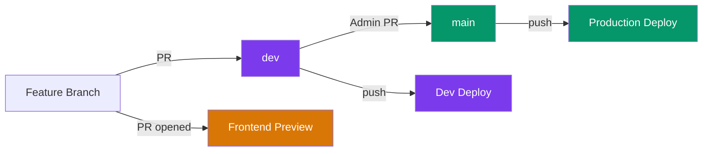

# CI/CD Pipeline

Continuous Integration and Continuous Deployment for CampusOS.

## Branching Strategy

CampusOS uses a two-branch deployment model:

| Branch | Purpose                             | Who Can Merge | Deploys To          |
| ------ | ----------------------------------- | ------------- | ------------------- |
| `main` | Stable, production-ready code       | Admins only   | **Production**      |
| `dev`  | Active development, latest features | Maintainers   | **Dev environment** |



> [!IMPORTANT]
> **Contributors** always open PRs to `dev`. Only **admins** create PRs from `dev` → `main`.

---

## CI — Quality Checks

CI runs automatically on every **pull request** and **push** to `main` or `dev`.

All 5 checks run **in parallel** for fast feedback:

| Check            | Command             | What It Validates                 |
| ---------------- | ------------------- | --------------------------------- |
| **Lint**         | `pnpm lint`         | ESLint across all workspaces      |
| **Type Check**   | `pnpm type-check`   | TypeScript strictness (frontend)  |
| **Format Check** | `pnpm format:check` | Prettier compliance               |
| **Test**         | `pnpm test`         | Test suites across all workspaces |
| **Build**        | `pnpm build`        | Frontend compiles without errors  |

**Workflow file**: [`.github/workflows/ci.yml`](../../.github/workflows/ci.yml)

---

## CD — Deployments

CampusOS uses **two separate hosting platforms**:

| Component    | Platform                     | Method          |
| ------------ | ---------------------------- | --------------- |
| **Frontend** | [Vercel](https://vercel.com) | Git Integration |
| **Backend**  | [Render](https://render.com) | Git Integration |

Both platforms auto-deploy when code is pushed — no GitHub Actions are used for deployment.

### Live URLs

| Service         | URL                                                                  |
| --------------- | -------------------------------------------------------------------- |
| Backend (dev)   | https://campus-os-backend.onrender.com                               |
| Frontend (prod) | https://campus-os-frontend.vercel.app                                |
| Frontend (dev)  | https://campus-os-frontend-git-dev-techshreyashs-projects.vercel.app |
| Frontend (PR)   | Auto-generated unique URL per PR (commented by Vercel bot)           |

### How Deployments Are Triggered

| Trigger              | Frontend (Vercel)          | Backend (Render)                   |
| -------------------- | -------------------------- | ---------------------------------- |
| PR opened/updated    | ✅ Auto-deploys preview    | ✅ Auto-deploys preview            |
| Push/merge to `dev`  | ✅ Auto-deploys dev        | ✅ Auto-deploys dev                |
| Push/merge to `main` | ✅ Auto-deploys production | — (Render deploys from `dev` only) |

---

### Preview Deployments (Pull Requests)

When a Pull Request is opened or updated, both Vercel (Frontend) and Render (Backend) automatically spin up preview environments.

To provide a seamless testing experience without complex routing:

1. A GitHub Action ([`.github/workflows/preview-environments.yml`](../../.github/workflows/preview-environments.yml)) listens for these successful deployments.
2. It automatically posts a comment on the PR linking the Frontend preview directly to the Backend preview using a `?backend=` query parameter.
3. The frontend automatically detects this query parameter, securely saves it to `localStorage`, and redirects to strip it from the URL. All subsequent API requests naturally route to the preview backend.

### Frontend Deployments (Vercel)

Vercel's Git Integration handles frontend deployments automatically:

- **PR opened/updated** → Vercel deploys a unique preview URL.
- **Push to `dev`** → Vercel deploys to the dev frontend URL.
- **Push to `main`** → Vercel deploys to production.

### Backend Deployments (Render)

Render's Git Integration auto-deploys the backend:

- **PR opened/updated** → Render deploys a unique preview URL for testing backend changes in isolation.
- **Push to `dev`** → Render deploys the stable dev backend URL: `https://campus-os-backend.onrender.com`.

> [!NOTE]
> Render's free tier may spin down after inactivity. The first request after idle may take ~30 seconds to respond while the service starts up.

---

## Contributor Workflow

```
1. Fork the repo on GitHub
2. Clone your fork locally
3. Create a feature branch from `dev`
4. Make your changes, commit
5. Run `pnpm format` to format your code
6. Push to your fork
7. Open a PR targeting the `dev` branch
   → CI checks run automatically (lint, type-check, format, test, build)
   → Vercel and Render auto-deploy preview environments.
   → GitHub Actions comments on the PR with the linked Preview URL.
8. A maintainer reviews your code
9. Address review feedback, push new commits — frontend preview auto-updates
10. Maintainer merges your PR into `dev`
    → Frontend redeploys with the latest `dev` state
    → Backend redeploys on Render with the latest `dev` state
```

> [!WARNING]
> **Always run `pnpm format` before pushing.** CI runs `pnpm format:check` and will **reject** your PR if code isn't Prettier-formatted.

> [!NOTE]
> You never need to interact with the `main` branch. That's handled by admins when they're ready to release to production.

---

## Admin Setup Guide

> [!IMPORTANT]
> These steps must be completed **once** before the CI/CD pipeline will work.

### Step 1: Configure Vercel (Frontend)

1. Go to [vercel.com](https://vercel.com) → **New Project**
2. Import the **NITRR-Official/CampusOS** GitHub repository
3. Configure the project:

| Setting               | Value                |
| --------------------- | -------------------- |
| **Project Name**      | `campus-os-frontend` |
| **Root Directory**    | `frontend`           |
| **Production Branch** | `main`               |

4. **Settings → Deployment Protection**:
   - Disable **Vercel Authentication** for Preview deployments (so contributors can access preview URLs without a Vercel account)

5. **Settings → Git → Git Fork Protection**:
   - Disable **Git Fork Protection** (so preview deployments from forked PRs deploy automatically without requiring maintainer approval)

6. **Settings → Environment Variables**:

| Variable                       | Environment    | Value                                    |
| ------------------------------ | -------------- | ---------------------------------------- |
| `NEXT_PUBLIC_API_URL`          | **Production** | `https://campus-os-backend.onrender.com` |
| `NEXT_PUBLIC_API_URL`          | **Preview**    | `https://campus-os-backend.onrender.com` |
| `ENABLE_EXPERIMENTAL_COREPACK` | **Both**       | `1`                                      |

### Step 2: Configure Render (Backend)

1. Go to [render.com](https://render.com) → **New → Web Service**
2. Connect the **NITRR-Official/CampusOS** GitHub repository
3. Configure the service:

| Setting            | Value               |
| ------------------ | ------------------- |
| **Name**           | `campus-os-backend` |
| **Branch**         | `dev`               |
| **Root Directory** | `backend`           |
| **Runtime**        | Node                |
| **Build Command**  | `pnpm install`      |
| **Start Command**  | `node src/index.js` |

4. **Environment Variables**:

| Variable             | Value                                   | Notes                                            |
| -------------------- | --------------------------------------- | ------------------------------------------------ |
| `NODE_ENV`           | `development`                           | Dev fallbacks, verbose errors                    |
| `PORT`               | `10000`                                 | Render's default port                            |
| `MONGODB_URI`        | `mongodb+srv://...campusos-dev`         | MongoDB Atlas connection string                  |
| `JWT_SECRET`         | `<your-dev-secret>`                     | Secret for JWT signing                           |
| `FRONTEND_URL`       | `https://campus-os-frontend.vercel.app` | CORS: exact match for production frontend        |
| `ALLOW_PREVIEW_CORS` | `true`                                  | Allows any `*.vercel.app` origin for PR previews |

### Step 3: Enable Branch Protection (GitHub)

In GitHub → **Settings → Branches → Add rule**:

**For `main`:**

- ✅ Require status checks to pass (select: `Lint`, `Type Check`, `Format Check`, `Test`, `Build`)
- ✅ Require pull request reviews before merging
- ✅ Restrict who can push (admins only)

**For `dev`:**

- ✅ Require status checks to pass (same checks)

---

## CORS for Preview Deployments

PR frontend preview URLs are unique per commit (e.g., `campus-os-frontend-abc123.vercel.app`), so the backend can't know them in advance.

The solution: when `ALLOW_PREVIEW_CORS=true` is set on the Render backend, it allows **any** `*.vercel.app` origin. This is safe because:

- The dev backend uses a **separate database** (`campusos-dev`)
- Only applies to `https://*.vercel.app` domains (not arbitrary origins)
- Production frontend uses exact-match CORS via `FRONTEND_URL`

---

## Workflow Files Reference

| File                                                                           | Trigger                    | Purpose                                                                  |
| ------------------------------------------------------------------------------ | -------------------------- | ------------------------------------------------------------------------ |
| [`ci.yml`](../../.github/workflows/ci.yml)                                     | PR or push to `main`/`dev` | 5 parallel quality checks                                                |
| [`preview-environments.yml`](../../.github/workflows/preview-environments.yml) | Deployment Status          | Combines Frontend/Backend previews into a single URL and comments on PRs |
| Vercel Git Integration                                                         | PR opened                  | Frontend preview deployment (auto)                                       |
| Vercel Git Integration                                                         | Push to `dev`              | Frontend dev deployment (auto)                                           |
| Vercel Git Integration                                                         | Push to `main`             | Frontend production deployment (auto)                                    |
| Render Git Integration                                                         | PR opened                  | Backend preview deployment (auto)                                        |
| Render Git Integration                                                         | Push to `dev`              | Backend deployment (auto)                                                |

---

**See Also**: [Git Workflow](./GIT_WORKFLOW.md) · [Environment Variables](../getting-started/ENVIRONMENT.md) · [Contributing](../contributing/CONTRIBUTING.md)
