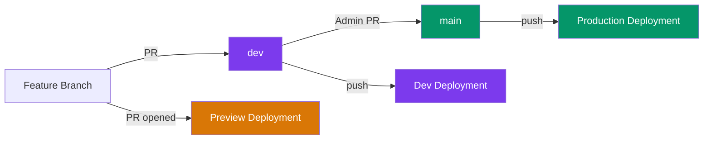

# CI/CD Pipeline

Continuous Integration and Continuous Deployment for CampusOS.

## Branching Strategy

CampusOS uses a two-branch deployment model:

| Branch | Purpose                             | Who Can Merge | Deploys To          |
| ------ | ----------------------------------- | ------------- | ------------------- |
| `main` | Stable, production-ready code       | Admins only   | **Production**      |
| `dev`  | Active development, latest features | Maintainers   | **Dev environment** |



> [!IMPORTANT]
> **Contributors** always open PRs to `dev`. Only **admins** create PRs from `dev` → `main`.

---

## CI — Quality Checks

CI runs automatically on every **pull request** and **push** to `main` or `dev`.

All 5 checks run **in parallel** for fast feedback:

| Check            | Command             | What It Validates                 |
| ---------------- | ------------------- | --------------------------------- |
| **Lint**         | `pnpm lint`         | ESLint across all workspaces      |
| **Type Check**   | `pnpm type-check`   | TypeScript strictness (frontend)  |
| **Format Check** | `pnpm format:check` | Prettier compliance               |
| **Test**         | `pnpm test`         | Test suites across all workspaces |
| **Build**        | `pnpm build`        | Frontend compiles without errors  |

**Workflow file**: [`.github/workflows/ci.yml`](../../.github/workflows/ci.yml)

---

## CD — Deployments

Both the **frontend** (Next.js) and **backend** (Express) are deployed to [Vercel](https://vercel.com).

### How Deployments Are Triggered

| Trigger              | Workflow                | Vercel Environment | Result                                 |
| -------------------- | ----------------------- | ------------------ | -------------------------------------- |
| PR opened/updated    | `vercel-preview.yml`    | Preview            | Unique URL per PR, commented on the PR |
| Push/merge to `dev`  | `vercel-dev.yml`        | Preview            | Dev environment URL (latest on `dev`)  |
| Push/merge to `main` | `vercel-production.yml` | Production         | Production domain                      |

### Preview Deployments (PRs)

When a PR is opened to `dev` or `main`:

1. Both frontend and backend are deployed to unique preview URLs
2. A bot comments the URLs directly on the PR
3. Reviewers can test the changes live before approving
4. The comment updates automatically on subsequent pushes

**Workflow file**: [`.github/workflows/vercel-preview.yml`](../../.github/workflows/vercel-preview.yml)

### Dev Deployments

When code is merged into `dev`:

1. Both frontend and backend are deployed to the dev environment
2. This reflects the latest state of active development
3. Used for integration testing before promoting to production

**Workflow file**: [`.github/workflows/vercel-dev.yml`](../../.github/workflows/vercel-dev.yml)

### Production Deployments

When code is merged into `main`:

1. Both frontend and backend are deployed to production
2. The production domain (e.g., `campus-os-frontend.vercel.app`) is updated
3. This should only happen after thorough testing on `dev`

**Workflow file**: [`.github/workflows/vercel-production.yml`](../../.github/workflows/vercel-production.yml)

---

## Contributor Workflow

```
1. Fork the repo on GitHub
2. Clone your fork locally
3. Create a feature branch from `dev`
4. Make your changes, commit
5. Run `pnpm format` to format your code
6. Push to your fork
7. Open a PR targeting the `dev` branch
   → CI checks run automatically
   → Preview deployment is created
8. Address review feedback
9. Maintainer merges your PR into `dev`
   → Dev deployment is triggered
```

> [!WARNING]
> **Always run `pnpm format` before pushing.** CI runs `pnpm format:check` and will **reject** your PR if code isn't Prettier-formatted.

> [!NOTE]
> You never need to interact with the `main` branch. That's handled by admins when they're ready to release to production.

---

## Admin Setup Guide

> [!IMPORTANT]
> These steps must be completed **once** before the CI/CD workflows will work.

### Step 1: Link Vercel Projects

```bash
# Install Vercel CLI
npm i -g vercel

# Login
vercel login

# Link frontend
cd frontend
vercel link

# Link backend
cd ../backend
vercel link
```

This creates `.vercel/project.json` in both directories with `orgId` and `projectId`.

### Step 2: Get a Vercel Token

1. Go to [vercel.com/account/tokens](https://vercel.com/account/tokens)
2. Create a token named `CampusOS GitHub Actions`
3. Copy the token

### Step 3: Add GitHub Repository Secrets

Go to **Settings → Secrets and variables → Actions → New repository secret**:

| Secret Name                  | Value                   | Source                          |
| ---------------------------- | ----------------------- | ------------------------------- |
| `VERCEL_TOKEN`               | Your Vercel API token   | Step 2                          |
| `VERCEL_ORG_ID`              | Your Vercel org/user ID | `frontend/.vercel/project.json` |
| `VERCEL_PROJECT_ID_FRONTEND` | Frontend project ID     | `frontend/.vercel/project.json` |
| `VERCEL_PROJECT_ID_BACKEND`  | Backend project ID      | `backend/.vercel/project.json`  |

### Step 4: Disable Vercel's Built-in Git Integration

> [!WARNING]
> Skip this and Vercel will deploy twice — once from its Git integration and once from the GitHub Action.

1. Go to both projects on [vercel.com](https://vercel.com)
2. **Settings → Git**
3. Set **Ignored Build Step** to `exit 0`

### Step 5: Add Environment Variables in Vercel

Go to each project on [vercel.com](https://vercel.com) → **Settings → Environment Variables**.

Add variables for **both Production and Preview** environments:

#### Frontend

| Variable              | Description            | Example                                |
| --------------------- | ---------------------- | -------------------------------------- |
| `NEXT_PUBLIC_API_URL` | Backend deployment URL | `https://campus-os-backend.vercel.app` |

#### Backend

| Variable         | Required | Description                                        | Example                                     |
| ---------------- | -------- | -------------------------------------------------- | ------------------------------------------- |
| `MONGODB_URI`    | ✅       | MongoDB connection string                          | `mongodb+srv://...`                         |
| `JWT_SECRET`     | ✅       | JWT signing key (crashes without it in production) | `your-secure-secret`                        |
| `FRONTEND_URL`   | ✅       | Frontend URL for CORS                              | `https://campus-os-frontend.vercel.app`     |
| `FRONTEND_URLS`  |          | Multiple CORS origins (comma-separated)            | `https://a.vercel.app,https://b.vercel.app` |
| `JWT_EXPIRES_IN` |          | Token expiry, defaults to `15m`                    | `15m`                                       |

### Step 6: Configure Monorepo Root Directories

The backend depends on `apps/` and `shared/` — Vercel needs to know this is a pnpm monorepo.

1. Frontend project → **Settings → General → Root Directory** → `frontend`
2. Backend project → **Settings → General → Root Directory** → `backend`

> [!TIP]
> Vercel will detect `pnpm-workspace.yaml` in the parent folder and run `pnpm install` at the monorepo root, resolving workspace dependencies.

### Step 7: Enable Branch Protection

In GitHub → **Settings → Branches → Add rule**:

**For `main`:**

- ✅ Require status checks to pass (select: `Lint`, `Type Check`, `Format Check`, `Test`, `Build`)
- ✅ Require pull request reviews before merging
- ✅ Restrict who can push (admins only)

**For `dev`:**

- ✅ Require status checks to pass (same checks)

---

## Workflow Files Reference

| File                                                                     | Trigger                    | Purpose                         |
| ------------------------------------------------------------------------ | -------------------------- | ------------------------------- |
| [`ci.yml`](../../.github/workflows/ci.yml)                               | PR or push to `main`/`dev` | 5 parallel quality checks       |
| [`vercel-preview.yml`](../../.github/workflows/vercel-preview.yml)       | PR to `main`/`dev`         | Preview deployment + PR comment |
| [`vercel-dev.yml`](../../.github/workflows/vercel-dev.yml)               | Push to `dev`              | Dev environment deployment      |
| [`vercel-production.yml`](../../.github/workflows/vercel-production.yml) | Push to `main`             | Production deployment           |

---

**See Also**: [Git Workflow](./GIT_WORKFLOW.md) · [Deployment Guide](./DEPLOYMENT.md) · [Environment Variables](../getting-started/ENVIRONMENT.md) · [Contributing](../contributing/CONTRIBUTING.md)
