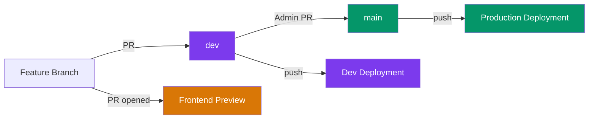
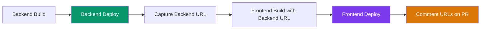

# CI/CD Pipeline

Continuous Integration and Continuous Deployment for CampusOS.

## Branching Strategy

CampusOS uses a two-branch deployment model:

| Branch | Purpose                             | Who Can Merge | Deploys To          |
| ------ | ----------------------------------- | ------------- | ------------------- |
| `main` | Stable, production-ready code       | Admins only   | **Production**      |
| `dev`  | Active development, latest features | Maintainers   | **Dev environment** |



> [!IMPORTANT]
> **Contributors** always open PRs to `dev`. Only **admins** create PRs from `dev` → `main`.

---

## CI — Quality Checks

CI runs automatically on every **pull request** and **push** to `main` or `dev`.

All 5 checks run **in parallel** for fast feedback:

| Check            | Command             | What It Validates                 |
| ---------------- | ------------------- | --------------------------------- |
| **Lint**         | `pnpm lint`         | ESLint across all workspaces      |
| **Type Check**   | `pnpm type-check`   | TypeScript strictness (frontend)  |
| **Format Check** | `pnpm format:check` | Prettier compliance               |
| **Test**         | `pnpm test`         | Test suites across all workspaces |
| **Build**        | `pnpm build`        | Frontend compiles without errors  |

**Workflow file**: [`.github/workflows/ci.yml`](../../.github/workflows/ci.yml)

---

## CD — Deployments

Both the **frontend** (Next.js) and **backend** (Express) are deployed to [Vercel](https://vercel.com) using a **hybrid approach**:

1. **Vercel Git Integration** — Auto-deploys frontend on PRs, and both frontend + backend on `dev`/`main` pushes
2. **GitHub Action** — Creates linked full-stack previews when a maintainer adds the `full-preview` label

### How Deployments Are Triggered

| Trigger | Frontend | Backend | Method |
| --- | --- | --- | --- |
| PR opened/updated | ✅ Auto-deploys (uses dev backend) | ⏭️ Skipped | Vercel Git Integration |
| PR with `full-preview` label | ✅ Deployed (linked to backend) | ✅ Deployed | GitHub Action |
| Push/merge to `dev` | ✅ Auto-deploys | ✅ Auto-deploys | Vercel Git Integration |
| Push/merge to `main` | ✅ Auto-deploys | ✅ Auto-deploys | Vercel Git Integration |

---

### Preview Deployments (PRs)

All PRs must target the **`dev`** branch.

When a PR is opened:

1. **CI checks** run automatically (lint, type-check, format, test, build)
2. If the contributor is **new**, a maintainer must authorize the fork's deployment on Vercel (one-time per contributor — Vercel comments on the PR asking for authorization)
3. **Vercel auto-deploys the frontend only** to a unique preview URL
4. The **backend is NOT auto-deployed** on PRs — the frontend preview uses the **stable dev branch backend URL**

This is sufficient for the majority of PRs which only change frontend code.

> [!NOTE]
> Backend PR builds are intentionally skipped using Vercel's [Ignored Build Step](https://vercel.com/docs/deployments/configure-a-build#ignored-build-step). The command `test -n "$VERCEL_GIT_PULL_REQUEST_ID"` skips builds when a Pull Request ID is present, but allows builds on direct pushes to `main`/`dev`.

### Full-Stack Preview Deployments (Label-Gated)

If a PR includes **backend changes** and the maintainer wants a linked preview:

1. Maintainer adds the **`full-preview`** label to the PR
2. GitHub Action deploys backend first → captures its unique preview URL
3. Frontend builds with `NEXT_PUBLIC_API_URL` set to the backend preview URL
4. Frontend deploys → both URLs are commented on the PR
5. **Subsequent commits** to the PR automatically re-deploy while the label is present
6. Maintainer can remove the label to stop full-preview deployments



> [!IMPORTANT]
> The `full-preview` label is required for security. GitHub does not pass secrets to workflows triggered by fork PRs. Using `pull_request_target` with a label gate ensures a maintainer has reviewed the code before it accesses deployment credentials.

**Workflow file**: [`.github/workflows/vercel-preview.yml`](../../.github/workflows/vercel-preview.yml)

### Dev Deployments

When code is pushed or merged into the **`dev`** branch, Vercel Git Integration auto-deploys **both** frontend and backend. This reflects the latest state of active development.

### Production Deployments

When code is pushed or merged into the **`main`** branch (typically via a `dev` → `main` PR by admins), Vercel Git Integration auto-deploys **both** frontend and backend to production. This is considered the **stable, production-ready** release.

---

## Contributor Workflow

```
1. Fork the repo on GitHub
2. Clone your fork locally
3. Create a feature branch from `dev`
4. Make your changes, commit
5. Run `pnpm format` to format your code
6. Push to your fork
7. Open a PR targeting the `dev` branch
   → CI checks run automatically (lint, type-check, format, test, build)
   → First-time contributors: Vercel asks a maintainer to authorize
     your deployment (one-time)
   → Vercel auto-deploys a frontend preview (connected to the dev backend)
8. A maintainer reviews your code
9. If your PR includes backend changes:
   → Maintainer adds the `full-preview` label
   → Both backend and frontend are deployed as a linked pair
   → Preview URLs are commented on your PR
   → Further commits auto-redeploy while the label is present
10. Address review feedback, push new commits — previews auto-update
11. Maintainer merges your PR into `dev`
    → Both frontend and backend redeploy with the latest `dev` state
```

> [!WARNING]
> **Always run `pnpm format` before pushing.** CI runs `pnpm format:check` and will **reject** your PR if code isn't Prettier-formatted.

> [!NOTE]
> You never need to interact with the `main` branch. That's handled by admins when they're ready to release to production.

---

## Admin Setup Guide

> [!IMPORTANT]
> These steps must be completed **once** before the CI/CD workflows will work.

### Step 1: Connect Vercel to GitHub

1. Go to [vercel.com](https://vercel.com) → each project → **Settings → Git**
2. Connect to the **NITRR-Official/CampusOS** GitHub repository
3. Set **Production Branch** to `main`

This enables Vercel to auto-deploy on pushes and PRs.

### Step 2: Configure Vercel Projects

For each Vercel project:

1. **Settings → Build and Deployment → Root Directory**:
   - Frontend project → `frontend`
   - Backend project → `backend`

2. **Backend project only — Settings → Build and Deployment → Ignored Build Step**:
   - Set Behavior to **Custom**
   - Set Command to: `test -n "$VERCEL_GIT_PULL_REQUEST_ID"`
   - This skips backend builds on PRs but allows them on `main`/`dev` pushes

3. **Both projects — Settings → Deployment Protection**:
   - Disable **Vercel Authentication** for Preview deployments (so contributors can access preview URLs without a Vercel account)

4. **Both projects — Environment Variables**:
   - Add `ENABLE_EXPERIMENTAL_COREPACK` = `1` (Production + Preview) to use pnpm@10

> [!TIP]
> Vercel will detect `pnpm-workspace.yaml` in the parent folder and run `pnpm install` at the monorepo root, resolving workspace dependencies.

### Step 3: Add GitHub Repository Secrets

These are only needed for the `full-preview` label-gated workflow.

Go to the **main repo** → **Settings → Secrets and variables → Actions → New repository secret**:

| Secret Name                  | Value                   | Source                          |
| ---------------------------- | ----------------------- | ------------------------------- |
| `VERCEL_TOKEN`               | Your Vercel API token   | [vercel.com/account/tokens](https://vercel.com/account/tokens) |
| `VERCEL_ORG_ID`              | Your Vercel org/user ID | `frontend/.vercel/project.json` |
| `VERCEL_PROJECT_ID_FRONTEND` | Frontend project ID     | `frontend/.vercel/project.json` |
| `VERCEL_PROJECT_ID_BACKEND`  | Backend project ID      | `backend/.vercel/project.json`  |

### Step 4: Add Environment Variables in Vercel

Go to each project on [vercel.com](https://vercel.com) → **Settings → Environment Variables**.

> [!IMPORTANT]
> Use **separate MongoDB databases** for Production and Preview to keep data isolated.

#### Frontend — Environment Variables

| Variable              | Environment    | Value                                  | Notes                                                   |
| --------------------- | -------------- | -------------------------------------- | ------------------------------------------------------- |
| `NEXT_PUBLIC_API_URL` | **Production** | `https://campus-os-backend.vercel.app` | Stable backend production URL                           |
| `NEXT_PUBLIC_API_URL` | **Preview**    | Backend's dev branch preview URL       | Used by Vercel auto-deploys (overridden by `full-preview` workflow) |

#### Backend — Environment Variables

| Variable             | Environment    | Value                                      | Notes                                          |
| -------------------- | -------------- | ------------------------------------------ | ---------------------------------------------- |
| `NODE_ENV`           | **Production** | `production`                               | Strict error handling, no fallback secrets      |
| `NODE_ENV`           | **Preview**    | `development`                              | Verbose errors, dev fallbacks                   |
| `MONGODB_URI`        | **Production** | `mongodb+srv://...campusos-prod`           | Production database (isolated)                  |
| `MONGODB_URI`        | **Preview**    | `mongodb+srv://...campusos-dev`            | Dev database (separate from production)         |
| `JWT_SECRET`         | **Production** | `<strong-random-secret>`                   | Unique to production                            |
| `JWT_SECRET`         | **Preview**    | `<different-dev-secret>`                   | Unique to preview, different from production    |
| `FRONTEND_URL`       | **Production** | `https://campus-os-frontend.vercel.app`    | CORS: exact match for production frontend       |
| `FRONTEND_URL`       | **Preview**    | `https://campus-os-frontend-git-dev-<user>.vercel.app` | CORS: dev branch frontend URL          |
| `ALLOW_PREVIEW_CORS` | **Preview**    | `true`                                     | Allows any `*.vercel.app` origin for PR previews |
| `JWT_EXPIRES_IN`     | **Both**       | `15m`                                      | Optional, defaults to `15m`                     |

> [!WARNING]
> **Never use the same `MONGODB_URI` for Production and Preview.** Preview deployments could accidentally modify production data. Create two separate databases on [MongoDB Atlas](https://cloud.mongodb.com) (e.g., `campusos-prod` and `campusos-dev`).

### Step 5: Create the `full-preview` Label

Go to the **main repo** → **Issues → Labels → New label**:

| Label | Color | Description |
| --- | --- | --- |
| `full-preview` | `#7c3aed` | Triggers linked full-stack preview deployment |

### Step 6: Enable Branch Protection

In GitHub → **Settings → Branches → Add rule**:

**For `main`:**

- ✅ Require status checks to pass (select: `Lint`, `Type Check`, `Format Check`, `Test`, `Build`)
- ✅ Require pull request reviews before merging
- ✅ Restrict who can push (admins only)

**For `dev`:**

- ✅ Require status checks to pass (same checks)

---

## CORS for Preview Deployments

PR preview URLs are unique per commit (e.g., `frontend-abc123.vercel.app`), so the backend can't know them in advance.

The solution: when `ALLOW_PREVIEW_CORS=true` is set (Preview env only), the backend allows **any** `*.vercel.app` origin. This is safe because:

- Preview environments use a **separate database** (`campusos-dev`)
- The flag is **never set in Production** — production uses strict exact-match CORS
- Only applies to `https://*.vercel.app` domains (not arbitrary origins)

---

## Workflow Files Reference

| File | Trigger | Purpose |
| --- | --- | --- |
| [`ci.yml`](../../.github/workflows/ci.yml) | PR or push to `main`/`dev` | 5 parallel quality checks |
| [`vercel-preview.yml`](../../.github/workflows/vercel-preview.yml) | `full-preview` label on PR | Linked full-stack preview deployment |
| Vercel Git Integration | Push to `main` | Production deployment (auto) |
| Vercel Git Integration | Push to `dev` | Dev environment deployment (auto) |
| Vercel Git Integration | PR opened | Frontend-only preview deployment (auto) |

---

**See Also**: [Git Workflow](./GIT_WORKFLOW.md) · [Deployment Guide](./DEPLOYMENT.md) · [Environment Variables](../getting-started/ENVIRONMENT.md) · [Contributing](../contributing/CONTRIBUTING.md)
